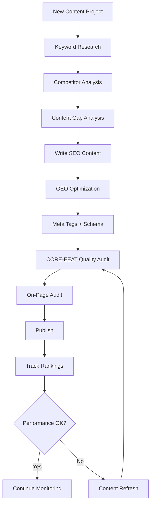

# SEO & GEO Skills Library

Claude Skills and Commands for Search Engine Optimization (SEO) and Generative Engine Optimization (GEO). 18 skills, 6 commands, tool-agnostic, works with or without integrations. Content quality powered by the [CORE-EEAT Content Benchmark](https://github.com/aaron-he-zhu/core-eeat-content-benchmark).

> **SEO** gets you ranked in search results. **GEO** gets you cited by AI systems (ChatGPT, Perplexity, Google AI Overviews). This library covers both.

## Quick Start

1. **Install** — copy skills into your Claude Code config:
   ```bash
   cp -r seo-geo-claude-skills/* ~/.claude/skills/
   ```

2. **Use immediately** — no tool integrations required:
   ```
   Research keywords for [your topic] and identify high-value opportunities
   ```

3. **Run a command** for a one-shot task:
   ```
   /seo:audit-page https://example.com/your-page
   ```

4. **Optionally connect tools** — edit [CONNECTORS.md](./CONNECTORS.md) to map `~~placeholders` to your toolstack (Ahrefs, SEMrush, Google Analytics, etc.)

## Methodology

Skills are organized into four phases. Use them in order for new projects, or jump to any phase as needed.

```
 RESEARCH          BUILD            OPTIMIZE          MONITOR
 ─────────         ─────────        ─────────         ─────────
 Keywords          Content          On-Page           Rankings
 Competitors       Meta Tags        Technical         Backlinks
 SERP              Schema           Links             Performance
 Gaps              GEO              Refresh           Alerts

 CROSS-CUTTING ──────────────────────────────────────────────────
 Content Quality Auditor (CORE-EEAT)  ·  Memory Management
```

## Skills

### Research — understand your market before creating content

| Skill | What it does |
|-------|-------------|
| [keyword-research](./research/keyword-research/) | Discover keywords with intent analysis, difficulty scoring, and topic clustering |
| [competitor-analysis](./research/competitor-analysis/) | Analyze competitor SEO/GEO strategies and find their weaknesses |
| [serp-analysis](./research/serp-analysis/) | Analyze search results and AI answer patterns for target queries |
| [content-gap-analysis](./research/content-gap-analysis/) | Find content opportunities your competitors cover but you don't |

### Build — create content optimized for search and AI

| Skill | What it does |
|-------|-------------|
| [seo-content-writer](./build/seo-content-writer/) | Write search-optimized content with proper structure and keyword placement |
| [geo-content-optimizer](./build/geo-content-optimizer/) | Make content quotable and citable by AI systems |
| [meta-tags-optimizer](./build/meta-tags-optimizer/) | Create compelling titles, descriptions, and Open Graph tags |
| [schema-markup-generator](./build/schema-markup-generator/) | Generate JSON-LD structured data for rich results |

### Optimize — improve existing content and technical health

| Skill | What it does |
|-------|-------------|
| [on-page-seo-auditor](./optimize/on-page-seo-auditor/) | Audit on-page elements with a scored report and fix recommendations |
| [technical-seo-checker](./optimize/technical-seo-checker/) | Check crawlability, indexing, Core Web Vitals, and site architecture |
| [internal-linking-optimizer](./optimize/internal-linking-optimizer/) | Optimize internal link structure for better crawling and authority flow |
| [content-refresher](./optimize/content-refresher/) | Update outdated content to recover or improve rankings |

### Monitor — track performance and catch issues early

| Skill | What it does |
|-------|-------------|
| [rank-tracker](./monitor/rank-tracker/) | Track keyword positions over time in both SERP and AI responses |
| [backlink-analyzer](./monitor/backlink-analyzer/) | Analyze backlink profile, find opportunities, detect toxic links |
| [performance-reporter](./monitor/performance-reporter/) | Generate SEO/GEO performance reports for stakeholders |
| [alert-manager](./monitor/alert-manager/) | Set up alerts for ranking drops, traffic changes, and technical issues |

### Cross-cutting — span all phases

| Skill | What it does |
|-------|-------------|
| [content-quality-auditor](./cross-cutting/content-quality-auditor/) | Full 80-item CORE-EEAT content quality audit with weighted scoring |
| [memory-management](./cross-cutting/memory-management/) | Two-layer project memory (hot cache + cold storage) for context across sessions |

## Commands

One-shot tasks with explicit input and structured output.

| Command | Description |
|---------|-------------|
| `/seo:audit-page <URL>` | Full on-page SEO + CORE-EEAT content quality audit with scored report |
| `/seo:check-technical <URL>` | Technical SEO health check (crawlability, speed, security) |
| `/seo:generate-schema <type>` | Generate JSON-LD structured data markup |
| `/seo:optimize-meta <URL>` | Optimize title, description, and OG tags |
| `/seo:report <domain> <period>` | Comprehensive SEO/GEO performance report |
| `/seo:setup-alert <metric>` | Configure monitoring alerts for critical metrics |

Command files: [commands/](./commands/)

## Architecture

### Tool-Agnostic Design

Skills use `~~category` placeholders instead of specific tool names. This decouples workflows from any particular vendor.

```
~~SEO tool       → Ahrefs, SEMrush, Moz, or any SEO platform
~~analytics      → Google Analytics, Adobe Analytics, Plausible
~~search console → Google Search Console, Bing Webmaster Tools
```

Full mapping of 14 tool categories: [CONNECTORS.md](./CONNECTORS.md)

### Progressive Enhancement

Every skill works at three integration levels:

| Tier | What you need | What you get |
|------|---------------|-------------|
| 1 | Nothing | Paste data manually — full analysis frameworks still apply |
| 2 | Basic MCP | Connect ~~search console or ~~analytics for auto data retrieval |
| 3 | Full stack | ~~SEO tool + ~~analytics + ~~search console for automated workflows |

### Skill Structure

Every SKILL.md follows the same section order:

```
Frontmatter → When to Use → What This Skill Does → How to Use
→ Data Sources → Instructions → Validation Checkpoints → Example
→ Tips for Success → Related Skills
```

### Design Principles

| Principle | How it's implemented |
|-----------|---------------------|
| Tool-agnostic | `~~category` placeholders + CONNECTORS.md |
| Progressive enhancement | Data Sources section with tiered fallbacks |
| Validation-first | Input + output checkpoints in every skill |
| Source attribution | Every recommendation cites its data source |
| Separation of concerns | Skills (knowledge) / Commands (actions) / Connectors (tools) |
| Cross-session memory | memory-management hot cache + cold storage |
| Content quality standard | CORE-EEAT benchmark integrated into creation, optimization, and auditing |

### CORE-EEAT Integration

Content quality is evaluated using the [CORE-EEAT Content Benchmark](https://github.com/aaron-he-zhu/core-eeat-content-benchmark) — 8 dimensions × 10 items = 80 checks covering both content body quality (CORE) and source credibility (EEAT).

| Integration point | How it works |
|-------------------|-------------|
| **Pre-write constraints** | seo-content-writer and geo-content-optimizer load high-weight checklist items before writing |
| **Post-write self-check** | Same skills verify output against loaded constraints |
| **Quick dimension score** | content-refresher scores 8 dimensions to focus refresh effort |
| **On-page quick scan** | on-page-seo-auditor checks 17 content-relevant items |
| **Meta tag alignment** | meta-tags-optimizer verifies C01 (Intent) and C02 (Direct Answer) |
| **Schema mapping** | schema-markup-generator maps content types to required schema via O05 |
| **Full 80-item audit** | content-quality-auditor runs the complete benchmark with weighted scoring |
| **Command integration** | `/seo:audit-page` includes CORE-EEAT scoring in the audit report |

Shared benchmark data: [references/core-eeat-benchmark.md](./references/core-eeat-benchmark.md)

### Reference Materials

Project-level shared reference: [references/core-eeat-benchmark.md](./references/core-eeat-benchmark.md) — CORE-EEAT benchmark data used across all skills.

Four skills also include `references/` subdirectories with supplementary material:

| Skill | References |
|-------|-----------|
| [seo-content-writer](./build/seo-content-writer/references/) | Title formulas, content structure templates |
| [geo-content-optimizer](./build/geo-content-optimizer/references/) | AI citation patterns, quotable content examples |
| [schema-markup-generator](./build/schema-markup-generator/references/) | JSON-LD templates, validation guide |
| [technical-seo-checker](./optimize/technical-seo-checker/references/) | robots.txt reference, HTTP status codes |

## Recommended Workflow



**Skill combos that work well together:**

- **keyword-research** + **content-gap-analysis** → comprehensive content strategy
- **seo-content-writer** + **geo-content-optimizer** → dual-optimized content
- **on-page-seo-auditor** + **technical-seo-checker** → complete site audit
- **rank-tracker** + **alert-manager** → proactive monitoring
- **content-quality-auditor** + **content-refresher** → data-driven content refresh
- **memory-management** + any skill → persistent project context

## Project Structure

```
seo-geo-claude-skills/
├── CONNECTORS.md                        # ~~placeholder → tool mapping
├── README.md
├── references/
│   └── core-eeat-benchmark.md           # Shared CORE-EEAT benchmark data
├── research/                            # Phase 1
│   ├── keyword-research/SKILL.md
│   ├── competitor-analysis/SKILL.md
│   ├── serp-analysis/SKILL.md
│   └── content-gap-analysis/SKILL.md
├── build/                               # Phase 2
│   ├── seo-content-writer/
│   │   ├── SKILL.md
│   │   └── references/
│   ├── geo-content-optimizer/
│   │   ├── SKILL.md
│   │   └── references/
│   ├── meta-tags-optimizer/SKILL.md
│   └── schema-markup-generator/
│       ├── SKILL.md
│       └── references/
├── optimize/                            # Phase 3
│   ├── on-page-seo-auditor/SKILL.md
│   ├── technical-seo-checker/
│   │   ├── SKILL.md
│   │   └── references/
│   ├── internal-linking-optimizer/SKILL.md
│   └── content-refresher/SKILL.md
├── monitor/                             # Phase 4
│   ├── rank-tracker/SKILL.md
│   ├── backlink-analyzer/SKILL.md
│   ├── performance-reporter/SKILL.md
│   └── alert-manager/SKILL.md
├── cross-cutting/                       # Span all phases
│   ├── content-quality-auditor/SKILL.md
│   └── memory-management/SKILL.md
└── commands/                            # User-invoked commands
    ├── audit-page.md
    ├── check-technical.md
    ├── generate-schema.md
    ├── optimize-meta.md
    ├── report.md
    └── setup-alert.md
```

## Contributing

1. Follow the existing SKILL.md section order (see any skill for reference)
2. Use `~~category` placeholders for tool references — see [CONNECTORS.md](./CONNECTORS.md)
3. Include Data Sources and Validation Checkpoints sections
4. Test across both SEO and GEO use cases
5. Submit a pull request

## License

Apache License 2.0
